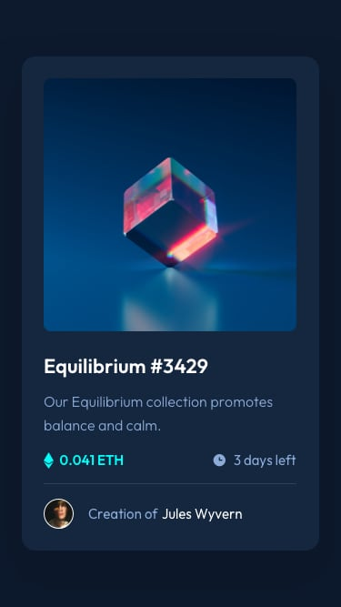

# Frontend Mentor - NFT preview card component

This is a solution to the [NFT preview card component challenge on Frontend Mentor](https://www.frontendmentor.io/challenges/nft-preview-card-component-SbdUL_w0U).

## Table of contents

- [Overview](#overview)
  - [Screenshot](#screenshot)
  - [Links](#links)
- [My process](#my-process)
  - [Built with](#built-with)
  - [What I learned](#what-i-learned)
  - [Continued development](#continued-development)
- [Author](#author)

---

## Overview

### Screenshot

|  |  |
| :--: | :--: |
| Desktop | Mobile |

### Links

- Solution URL: [Frontend Mentor](https://www.frontendmentor.io/solutions/nft-preview-card-component-GJ-nCAMQwB)
- Live Site URL: [GitHub Pages](https://rahulpaul127.github.io/nft-preview-card-component-main/)

---

## My process

### Built with

- Semantic HTML5 markup
- CSS custom properties (design tokens)
- CSS Flexbox
- Mobile-first responsive workflow

### What I learned

- How to implement a **CSS-only hover overlay** on an image — by absolutely positioning a tinted div (`inset: 0`) over the image inside a `position: relative` wrapper, then toggling `opacity` from `0` to `1` on parent hover. No JavaScript needed at all.
- Using **`hsla()` for the cyan overlay tint** (`hsla(178, 100%, 50%, 0.5)`) so the NFT image is still visible beneath the overlay while clearly indicating an interactive state, matching the design's active-state exactly.
- Structuring **CSS design tokens** with `:root` custom properties (e.g. `--color-blue-950`, `--color-cyan-400`) mapped directly from the style guide, making the entire color system a single source of truth and trivial to change.
- Applying the **BEM (Block Element Modifier) naming convention** consistently across the card component — `.card`, `.card__image-wrapper`, `.card__image-overlay`, `.card__meta`, `.card__creator` — for a flat, readable, and conflict-free stylesheet.
- Styling the **creator avatar** with a `1.5px solid white` border using `border-radius: 50%` to create the exact circular frame shown in the design.
- Using `transition: opacity 0.3s ease` on both the overlay and the underlying image simultaneously so the fade-in/fade-out feels smooth and consistent on hover.

### Continued development

- Add deployed links after publishing the project to GitHub Pages.
- Explore adding a **keyboard focus state** on the image link so the hover overlay also triggers on `:focus-visible` for full keyboard accessibility.
- Consider adding a subtle **card lift effect** (`box-shadow` + `transform: translateY`) on card hover for extra polish.

## Author

- Frontend Mentor - [@rahulpaul127](https://www.frontendmentor.io/profile/rahulpaul127)
- Twitter - [@rahulpaul127](https://x.com/rahulpaul127)
